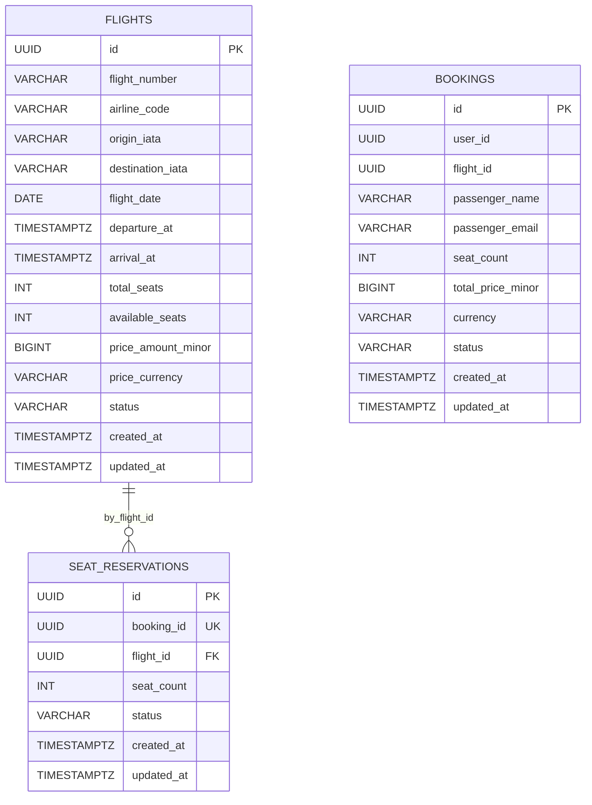

# ER Diagram

## Constraints

### FLIGHTS
- `UNIQUE (flight_number, flight_date)`
- `CHECK (total_seats > 0)`
- `CHECK (available_seats >= 0)`
- `CHECK (available_seats <= total_seats)`
- `CHECK (price_amount_minor > 0)`
- `CHECK (origin_iata <> destination_iata)`
- `CHECK (arrival_at > departure_at)`

### SEAT_RESERVATIONS
- `UNIQUE (booking_id)`
- `FOREIGN KEY (flight_id) REFERENCES flights(id)`
- `CHECK (seat_count > 0)`

### BOOKINGS
- `CHECK (seat_count > 0)`
- `CHECK (total_price_minor > 0)`

## Notes
- `SEAT_RESERVATIONS.booking_id` — логическая межсервисная ссылка на `BOOKINGS.id`
- физический `FOREIGN KEY` между `BOOKINGS` и `SEAT_RESERVATIONS` не используется, так как это разные БД